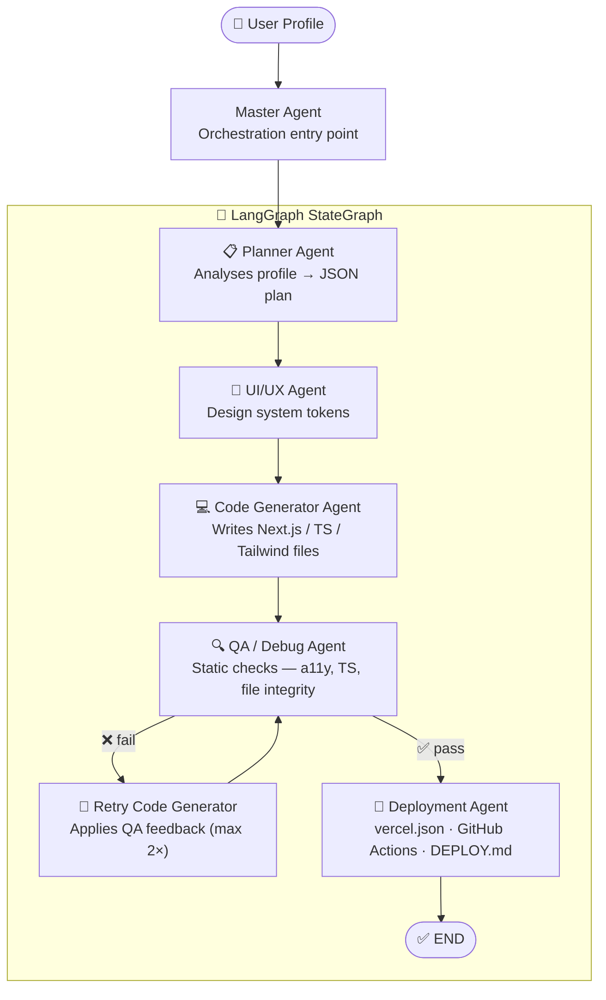

# Sungmin Kim — AI-Powered Portfolio

A **LangGraph multi-agent pipeline** powered by Claude Sonnet that automatically plans, designs, generates, QA-checks, and deploys a professional portfolio website.

Live site → deployed on **Vercel** via GitHub Actions CI/CD.

---

## Architecture Overview

The system is split into two layers:

| Layer | Purpose |
|-------|---------|
| **Python / LangGraph** | Multi-agent orchestration pipeline that builds the site |
| **Next.js / TypeScript** | The portfolio website itself, served to visitors |

```
User Profile (input)
       │
       ▼
  main.py (CLI)
       │
       ▼
  Master Agent
       │
       ▼
  LangGraph StateGraph
  ┌────────────────────────────────────────────────┐
  │                                                │
  │  planner → uiux → code_generator → qa_debug   │
  │                                        │       │
  │                                   pass / fail  │
  │                                   /         \  │
  │                          deployment     retry_codegen (max 2×)
  │                               │               │
  │                              END         qa_debug (loop)
  │                                                │
  └────────────────────────────────────────────────┘
```

---

## Agent Graph



---

## Tech Stack

### Python — Agent Pipeline

| Package | Version | Role |
|---------|---------|------|
| `langgraph` | ≥ 0.2.0 | State machine & agent graph orchestration |
| `langchain-anthropic` | ≥ 0.2.0 | LangChain ↔ Claude API bridge |
| `anthropic` | ≥ 0.40.0 | Claude Sonnet 4.6 LLM calls |
| `langchain-core` | ≥ 0.3.0 | Base runnables, messages, prompts |
| `python-dotenv` | ≥ 1.0.0 | `.env` environment management |

### Next.js — Portfolio Site

| Package | Version | Role |
|---------|---------|------|
| `next` | 14.2.29 | React framework (App Router) |
| `react` / `react-dom` | 18 | UI rendering |
| `typescript` | 5 | Static typing |
| `tailwindcss` | 3 | Utility-first CSS |
| `resend` | 6.12.4 | Transactional email (contact form) |
| `postcss` / `autoprefixer` | 8 / 10 | CSS build toolchain |

### Infrastructure & Deployment

| Tool | Role |
|------|------|
| **Vercel** | Production hosting, automatic preview deployments |
| **GitHub Actions** | CI — lint + type check + build on every push |
| **GitHub** | Source control & Vercel integration trigger |

---

## LangGraph State

```python
class PortfolioState(TypedDict, total=False):
    user_profile:      dict       # input: full user profile
    portfolio_plan:    str        # planner  → JSON site plan
    design_system:     dict       # uiux     → color / typography tokens
    generated_code:    dict       # codegen  → file path → content
    qa_report:         str        # qa_debug → plain-text QA report
    deployment_status: str        # deploy   → summary string
    current_phase:     str        # routing control signal
    errors:            list[str]  # accumulated error log
    messages:          list       # inter-agent message log
    qa_retry_count:    int        # prevents infinite QA loops
```

---

## Portfolio Site Design Tokens

| Token | Value |
|-------|-------|
| Background | `#0a0a0a` |
| Surface | `#111111` |
| Surface Alt | `#1a1a2e` |
| Accent (indigo) | `#6366f1` |
| Text primary | `#ffffff` |
| Text secondary | `#a1a1aa` |
| Heading font | Space Grotesk |
| Body font | Inter |
| Spacing base | 8 px |

---

## Portfolio Sections

| Section | Description |
|---------|-------------|
| **Hero** | Name, title, tagline |
| **Education** | Academic background |
| **Experience** | Work history (Tempus Labs, Carvi, First Analytics) |
| **Projects** | Featured AI portfolio project + past projects |
| **Courses & Lectures** | Inflearn & Udemy course links |
| **Publications** | AWS book (2023), Radiology paper (J Digit Imaging 2020) |
| **Certifications** | Professional certifications |
| **Contact** | Email form powered by Resend API |

---

## Quick Start

### 1. Clone & install Python deps

```bash
git clone https://github.com/kimx3129/sungmin-portfolio.git
cd sungmin-portfolio
pip install -r requirements.txt
```

### 2. Configure environment

```bash
copy .env.example .env
# Set ANTHROPIC_API_KEY in .env
```

### 3. Run the agent pipeline

```bash
python main.py
# Verbose mode:
python main.py --log-level DEBUG
```

### 4. Start the portfolio site

```bash
cd portfolio-site
npm install
npm run dev
# → http://localhost:3000
```

---

## Project Structure

```
sungmin-portfolio/
├── agents/
│   ├── master_agent.py           # orchestration entry point
│   ├── planner_agent.py          # Claude-powered portfolio planner
│   ├── uiux_agent.py             # design system token generator
│   ├── code_generator_agent.py   # writes Next.js files to disk
│   ├── qa_debug_agent.py         # static QA checks (a11y, TS, files)
│   └── deployment_agent.py       # vercel.json + GitHub Actions + docs
├── graph/
│   ├── state.py                  # PortfolioState TypedDict
│   └── portfolio_graph.py        # LangGraph StateGraph definition
├── portfolio-site/               # Next.js 14 portfolio website
│   ├── app/
│   │   ├── layout.tsx
│   │   ├── page.tsx
│   │   ├── globals.css
│   │   └── api/contact/route.ts  # Resend email API route
│   ├── components/
│   │   ├── Navigation.tsx
│   │   ├── Hero.tsx
│   │   ├── Education.tsx
│   │   ├── Experience.tsx
│   │   ├── Projects.tsx
│   │   ├── Blog.tsx              # Courses & Lectures
│   │   ├── Research.tsx
│   │   ├── Certifications.tsx
│   │   ├── Contact.tsx
│   │   └── Footer.tsx
│   ├── lib/data.ts               # all portfolio content (single source of truth)
│   ├── public/
│   │   └── [Sungmin]Resume.pdf   # downloadable resume
│   ├── tailwind.config.ts
│   ├── next.config.ts
│   ├── vercel.json               # security headers + deployment config
│   └── DEPLOY.md                 # detailed deployment guide
├── main.py                       # CLI entry point
├── requirements.txt
├── .env.example
└── README.md
```

---

## Requirements

- Python 3.11+
- Node.js 20+
- `ANTHROPIC_API_KEY` with access to `claude-sonnet-4-6`

---

Built with **LangGraph** + **Claude Sonnet 4.6** · Deployed on **Vercel**
